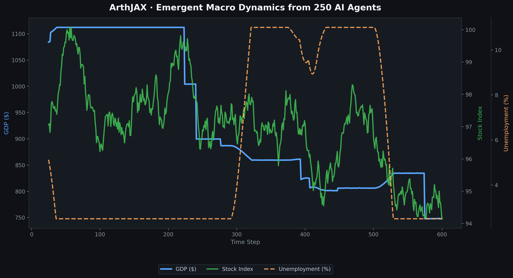

# ArthJAX

**GPU-accelerated agent-based macro simulator with neural world models — built in JAX.**

[](LICENSE)
[](https://www.python.org/)
[](https://github.com/VARUN3WARE/ArthJAX/actions/workflows/ci.yml)
[](https://github.com/VARUN3WARE/ArthJAX/releases)
[](https://github.com/VARUN3WARE/ArthJAX/issues?q=is%3Aissue+is%3Aopen+label%3A%22good+first+issue%22)
[](https://www.kaggle.com/code/varunraosfanlkan/arthjax-gpu-macro-abm-world-model)



---

## The problem

Real economies cannot be stress-tested in production. Central banks, researchers, and ML teams need a **fast, reproducible sandbox** where booms, credit crunches, and contagion can emerge from agent rules—not from scripted crashes.

## What ArthJAX is

ArthJAX simulates a synthetic economy on a GPU:

| | |
|---|---|
| **Agents** | 250 households (4 behavioral types) · 60 firms · 10 sectors |
| **Financial system** | Banks, credit stress, bad loans, leverage cycles |
| **Markets** | Stocks, commodities, FX, volatility clustering |
| **Macro policy** | Phillips curve · Taylor rule · structured shocks |
| **Contagion** | Multi-step propagation across a sector network |
| **AI layer** | Neural world model trained on simulation rollouts (v0.3) |

**600 timesteps in seconds** on GPU via JIT-compiled `lax.scan`.

> **Try it:** [Kaggle GPU demo](https://www.kaggle.com/code/varunraosfanlkan/arthjax-gpu-macro-abm-world-model) (Run All) · [Medium essay](https://medium.com/@varunrao.aiml/i-simulated-250-agents-on-a-gpu-and-watched-a-financial-crisis-emerge-without-writing-crash-now-3811a6ca5f92) on how it was built

---

## Run on Kaggle (GPU)

**Published notebook:** [ArthJAX GPU Macro ABM + World Model](https://www.kaggle.com/code/varunraosfanlkan/arthjax-gpu-macro-abm-world-model)

[](https://www.kaggle.com/code/varunraosfanlkan/arthjax-gpu-macro-abm-world-model)

1. Open the link → **Run All** (GPU + Internet already configured on the published kernel).
2. Download charts from the **Output** tab (`macro_evolution_v2.png`, `linkedin_hero.png`, etc.).

Fork from source: [notebooks/kaggle.ipynb](notebooks/kaggle.ipynb) · [notebooks/README.md](notebooks/README.md)

---

## Quick start

```bash
git clone https://github.com/VARUN3WARE/ArthJAX.git
cd ArthJAX
python -m venv .venv
source .venv/bin/activate
pip install -e .
python scripts/run_simulation.py --steps 600
python scripts/run_scenario.py --scenario credit_crunch --steps 600 --plot
python scripts/run_benchmarks.py --steps 600 --plot
python scripts/train_world_model.py --epochs 80 --plot
```

### GPU (optional)

Install JAX with CUDA support per [JAX installation docs](https://jax.readthedocs.io/en/latest/installation.html), then:

```bash
pip install -e .
```

---

## How ArthJAX compares

| Project | Focus | ArthJAX |
|---------|--------|---------|
| [AI Economist](https://github.com/salesforce/ai-economist) | 2D grid, RL tax policy | Macro banking + contagion + world model |
| [EconoJax](https://github.com/ponseko/econojax) | JAX + AI Economist + RL | Rule-based macro ABM, no RL required |
| LLM economies | Language-model agents | Differentiable physics, no API cost |
| DSGE solvers | Equation-based macro | Emergent multi-agent dynamics |

---

## Documentation

- [Medium — I Simulated 250 Agents on a GPU…](https://medium.com/@varunrao.aiml/i-simulated-250-agents-on-a-gpu-and-watched-a-financial-crisis-emerge-without-writing-crash-now-3811a6ca5f92) — essay on the build and why it exists
- [Public roadmap](docs/ROADMAP.md) — v0.6→v1.0 release plan
- [Methods & limitations](docs/METHODS.md) — agent rules, world model, stylized facts
- [Benchmark results](docs/BENCHMARKS.md) — pass/fail stylized facts table
- [Full showcase & chart guide](docs/ARTHJAX_SHOWCASE.md) — problem, results, chart reference
- [Contributing](CONTRIBUTING.md) — fork/PR flow, good first issues, review SLA
- [Writing seed issues](docs/CONTRIBUTING_ISSUES.md) — maintainer guide (GOOD checklist)

---

## Contributing

Contributions welcome — **fork → branch → PR** (maintainer merges to `main`). See [CONTRIBUTING.md](CONTRIBUTING.md) and [good first issues](https://github.com/VARUN3WARE/ArthJAX/issues?q=is%3Aissue+is%3Aopen+label%3A%22good+first+issue%22).

Track community work on the [Project board](https://github.com/users/VARUN3WARE/projects) (Backlog → Good first → Done).

If you're exploring the idea space: this is a **toy synthetic economy** for stress-testing and research prototypes, not a production forecasting tool. Issues and honest feedback are appreciated.

---

## Project structure

```
arthjax/          # Python package (simulation logic in v0.2+)
scripts/          # CLI entry points
notebooks/        # Demo & Kaggle notebooks
docs/             # Showcase and assets
tests/            # Test suite (v0.4)
```

---

## License

MIT — see [LICENSE](LICENSE).

---

## Author

[VARUN3WARE](https://github.com/VARUN3WARE)
